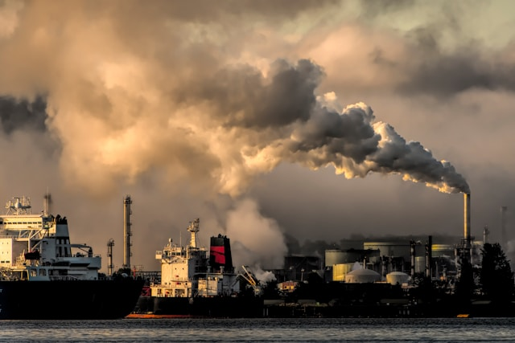

# SWProject-2
**Carbon Emissions Analysis**

**Here are some data samples**
| id           | company_id | country_id | industry_group_id | year | product_name                                                    | weight_kg | carbon_footprint_pcf | upstream_percent_total_pcf | operations_percent_total_pcf | downstream_percent_total_pcf | 
| -----------: | ---------: | ---------: | ----------------: | ---: | --------------------------------------------------------------: | --------: | -------------------: | -------------------------: | ---------------------------: | ---------------------------: | 
| 10056-1-2014 | 82         | 28         | 2                 | 2014 | Frosted Flakes(R) Cereal                                        | 0.7485    | 2                    | 57.50                      | 30.00                        | 12.50                        | 
| 10056-1-2015 | 82         | 28         | 15                | 2015 | "Frosted Flakes, 23 oz, produced in Lancaster, PA (one carton)" | 0.7485    | 2                    | 57.50                      | 30.00                        | 12.50                        | 
| 10222-1-2013 | 83         | 28         | 8                 | 2013 | Office Chair                                                    | 20.68     | 73                   | 80.63                      | 17.36                        | 2.01                         | 
| 10261-1-2017 | 14         | 16         | 25                | 2017 | Multifunction Printers                                          | 110       | 1488                 | 30.65                      | 5.51                         | 63.84                        | 
| 10261-2-2017 | 14         | 16         | 25                | 2017 | Multifunction Printers                                          | 110       | 1818                 | 25.08                      | 4.51                         | 70.41                        | 

**Research questions**

**1.Which products contribute the most to carbon emissions?**
```
SELECT DISTINCT
	product_name,
	carbon_footprint_pcf
FROM 
	product_emissions
ORDER BY carbon_footprint_pcf DESC
LIMIT 10
```

Top 10 product contributing to carbon emission
| product_name                                                                                                                       | carbon_footprint_pcf | 
| ---------------------------------------------------------------------------------------------------------------------------------: | -------------------: | 
| Wind Turbine G128 5 Megawats                                                                                                       | 3718044              | 
| Wind Turbine G132 5 Megawats                                                                                                       | 3276187              | 
| Wind Turbine G114 2 Megawats                                                                                                       | 1532608              | 
| Wind Turbine G90 2 Megawats                                                                                                        | 1251625              | 
| Land Cruiser Prado. FJ Cruiser. Dyna trucks. Toyoace.IMV def unit.                                                                 | 191687               | 
| Retaining wall structure with a main wall (sheet pile): 136 tonnes of steel sheet piles and 4 tonnes of tierods per 100 meter wall | 167000               | 
| TCDE                                                                                                                               | 99075                | 
| Mercedes-Benz GLE (GLE 500 4MATIC)                                                                                                 | 91000                | 
| Electric Motor                                                                                                                     | 87589                | 
| Mercedes-Benz S-Class (S 500)                                                                                                      | 85000                | 

**2. What are the industry groups of these products?**
```
SELECT DISTINCT
	industry.industry_group,
	product.product_name,
	product.carbon_footprint_pcf
FROM 
	product_emissions AS product
LEFT JOIN industry_groups AS industry
	ON	product.industry_group_id = industry.id
ORDER BY product.carbon_footprint_pcf DESC
LIMIT 10
```
| Industry                           | product_name                                                                                                                       | Total_Carbon_footprint | 
| ---------------------------------: | ---------------------------------------------------------------------------------------------------------------------------------: | ---------------------: | 
| Electrical Equipment and Machinery | Wind Turbine G128 5 Megawats                                                                                                       | 3718044                | 
| Electrical Equipment and Machinery | Wind Turbine G132 5 Megawats                                                                                                       | 3276187                | 
| Electrical Equipment and Machinery | Wind Turbine G114 2 Megawats                                                                                                       | 1532608                | 
| Electrical Equipment and Machinery | Wind Turbine G90 2 Megawats                                                                                                        | 1251625                | 
| Automobiles & Components           | Land Cruiser Prado. FJ Cruiser. Dyna trucks. Toyoace.IMV def unit.                                                                 | 191687                 | 
| Materials                          | Retaining wall structure with a main wall (sheet pile): 136 tonnes of steel sheet piles and 4 tonnes of tierods per 100 meter wall | 167000                 | 
| Materials                          | TCDE                                                                                                                               | 99075                  | 
| Materials                          | TCDE                                                                                                                               | 99075                  | 
| Automobiles & Components           | Mercedes-Benz GLE (GLE 500 4MATIC)                                                                                                 | 91000                  | 
| Capital Goods                      | Electric Motor                                                                                                                     | 87589                  | 

**3.What are the industries with the highest contribution to carbon emissions?**

```
 SELECT DISTINCT
 	industry.industry_group AS Industry,
 	sum(product.carbon_footprint_pcf) AS Total_Carbon_footprint
 FROM product_emissions AS product
 LEFT JOIN industry_groups AS industry
 	ON product.industry_group_id = industry.id
 GROUP BY industry.industry_group
 ORDER BY 2 DESC
 LIMIT 10'
```
Top 10 industries with the highest contribution to carbon emissions

| Industry                                         | Total_Carbon_footprint | 
| -----------------------------------------------: | ---------------------: | 
| Electrical Equipment and Machinery               | 9801558                | 
| Automobiles & Components                         | 2582264                | 
| Materials                                        | 577595                 | 
| Technology Hardware & Equipment                  | 363776                 | 
| Capital Goods                                    | 258712                 | 
| "Food, Beverage & Tobacco"                       | 111131                 | 
| "Pharmaceuticals, Biotechnology & Life Sciences" | 72486                  | 
| Chemicals                                        | 62369                  | 
| Software & Services                              | 46544                  | 
| Media                                            | 23017                  | 

**4.What are the companies with the highest contribution to carbon emissions?**
```
 SELECT
 	country.country_name,
 	company.company_name AS company,
 	sum(product.carbon_footprint_pcf) AS Total_Carbon_footprint
 FROM product_emissions AS product
 LEFT JOIN companies AS company
 	ON product.company_id = company.id
 LEFT JOIN countries AS country
 	ON product.country_id = country.id
 GROUP BY 2
 ORDER BY 3 DESC
 LIMIT 10
```
Top 10 companies with the highest contribution to carbon emissions

| country_name | company                                 | Total_Carbon_footprint | 
| -----------: | --------------------------------------: | ---------------------: | 
| Spain        | "Gamesa Corporación Tecnológica, S.A."  | 9778464                | 
| Germany      | Daimler AG                              | 1594300                | 
| Germany      | Volkswagen AG                           | 655960                 | 
| Japan        | "Mitsubishi Gas Chemical Company, Inc." | 212016                 | 
| Japan        | "Hino Motors, Ltd."                     | 191687                 | 
| Luxembourg   | Arcelor Mittal                          | 167007                 | 
| Brazil       | Weg S/A                                 | 160655                 | 
| USA          | General Motors Company                  | 137007                 | 
| USA          | "Lexmark International, Inc."           | 132012                 | 
| Japan        | "Daikin Industries, Ltd."               | 105600                 | 

**5. What are the countries with the highest contribution to carbon emissions?**
```
 SELECT
 	country.country_name,
 	sum(product.carbon_footprint_pcf) AS Total_Carbon_footprint
 FROM product_emissions AS product
 LEFT JOIN countries AS country
 	ON product.country_id = country.id
 GROUP BY 1
 ORDER BY 2 DESC
 LIMIT 10
```
Top 10 countries with the highest contribution to carbon emissions

| country_name | Total_Carbon_footprint | 
| -----------: | ---------------------: | 
| Spain        | 9786130                | 
| Germany      | 2251225                | 
| Japan        | 653237                 | 
| USA          | 518381                 | 
| South Korea  | 186965                 | 
| Brazil       | 169337                 | 
| Luxembourg   | 167007                 | 
| Netherlands  | 70417                  | 
| Taiwan       | 62875                  | 
| India        | 24574                  | 

**6.What is the trend of carbon footprints (PCFs) over the years?**
```
 SELECT
 	year AS Time,
 	SUM(carbon_footprint_pcf) as 'Carbon emission'
 FROM
	 product_emissions
 GROUP BY year
 ORDER BY year
```
Trend of carbon footprints (PCFs) from 2013-2017

| Time | Carbon emission | 
| ---: | --------------: | 
| 2013 | 503857          | 
| 2014 | 624226          | 
| 2015 | 10840415        | 
| 2016 | 1640182         | 
| 2017 | 340271          | 

**7. Which industry groups has demonstrated the most notable decrease in carbon footprints (PCFs) over time?**
```
 SELECT
	product.year AS Time,
 	industry.industry_group,
 	SUM(product.carbon_footprint_pcf)
 FROM
 	product_emissions AS product
 LEFT JOIN industry_groups AS industry
 	ON product.industry_group_id = industry.id
 GROUP BY 2, 1
 ORDER BY 2, 1, 3 DESC
```

| Time | industry_group                                                         | SUM(product.carbon_footprint_pcf) | 
| ---: | ---------------------------------------------------------------------: | --------------------------------: | 
| 2015 | "Consumer Durables, Household and Personal Products"                   | 931                               | 
| 2013 | "Food, Beverage & Tobacco"                                             | 4995                              | 
| 2014 | "Food, Beverage & Tobacco"                                             | 2685                              | 
| 2015 | "Food, Beverage & Tobacco"                                             | 0                                 | 
| 2016 | "Food, Beverage & Tobacco"                                             | 100289                            | 
| 2017 | "Food, Beverage & Tobacco"                                             | 3162                              | 
| 2015 | "Forest and Paper Products - Forestry, Timber, Pulp and Paper, Rubber" | 8909                              | 
| 2015 | "Mining - Iron, Aluminum, Other Metals"                                | 8181                              | 
| 2013 | "Pharmaceuticals, Biotechnology & Life Sciences"                       | 32271                             | 
| 2014 | "Pharmaceuticals, Biotechnology & Life Sciences"                       | 40215                             | 
| 2015 | "Textiles, Apparel, Footwear and Luxury Goods"                         | 387                               | 
| 2013 | Automobiles & Components                                               | 130189                            | 
| 2014 | Automobiles & Components                                               | 230015                            | 
| 2015 | Automobiles & Components                                               | 817227                            | 
| 2016 | Automobiles & Components                                               | 1404833                           | 

**Key Insights from Carbon Emission Data**

Based on the provided data and SQL query results, here are the key insights, interesting facts, and patterns discovered.

 **1. Products and Industries**

The products with the highest levels of carbon emissions are overwhelmingly associated with heavy industry.

* Dominance of Electrical Equipment: The top four most carbon-intensive products are all Wind Turbines. These are from the Electrical Equipment and Machinery industry, which, as a result, is the overall leading industry in carbon emissions with a total of over 9.8 million carbon footprint units.

* Automobiles' High Impact: The next major contributors are large vehicles. For example, the Land Cruiser Prado and Mercedes-Benz GLE models are significant emitters, placing the Automobiles & Components industry in second place with a total carbon footprint of over 2.5 million.

* Health and Carbon Footprint: As noted in the initial prompt, the Pharmaceuticals, Biotechnology & Life Sciences industry ranks as the 7th largest contributor to carbon emissions. This highlights that even industries essential for public health have a substantial environmental impact.

**2. Companies and Countries**

There is a direct correlation between the most polluting products, the companies that produce them, and the countries where those companies are based.

* Spain and Wind Turbines: The Spanish company "Gamesa Corporación Tecnológica, S.A." is responsible for the top carbon-emitting wind turbines. Consequently, Spain has the highest total carbon footprint among all countries, with over 9.7 million units. This demonstrates the outsized impact a single company in a specific industry can have on a country's emissions.

* Germany and Automobiles: The German automotive giants Daimler AG and Volkswagen AG are among the top five companies for carbon emissions. This contributes to Germany having the second-highest total country-level carbon footprint.

* Global Distribution: The top companies and countries are spread across the globe, including Asia (Japan), South America (Brazil), and North America (USA), indicating that high carbon-footprint industries are a global issue, not limited to a single region.

**3. Temporal Trends**

The data shows a clear and dramatic shift in total carbon emissions over the years.

* The 2015 Spike: A notable pattern is the massive spike in total carbon emissions in the year 2015, which saw an increase to over 10.8 million units. This is a significant jump compared to other years, which range from approximately 340,000 to 1.6 million units.

* Leading Industries' Impact Over Time: While the provided data for industry trends over time is limited, the dramatic increase in 2015 strongly suggests that a few highly carbon-intensive products, most likely the wind turbines from the Electrical Equipment and Machinery industry, were predominantly produced in that year. The total carbon footprint of the wind turbines alone (over 9.7 million) is nearly the same as the total for 2015.

* Industry Fluctuations: Some industries show significant year-over-year changes. For example, the carbon footprint for the "Food, Beverage & Tobacco" industry dropped to 0 in 2015 before spiking again in 2016.
